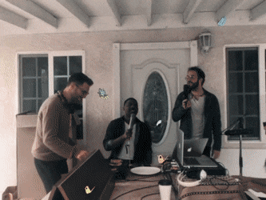
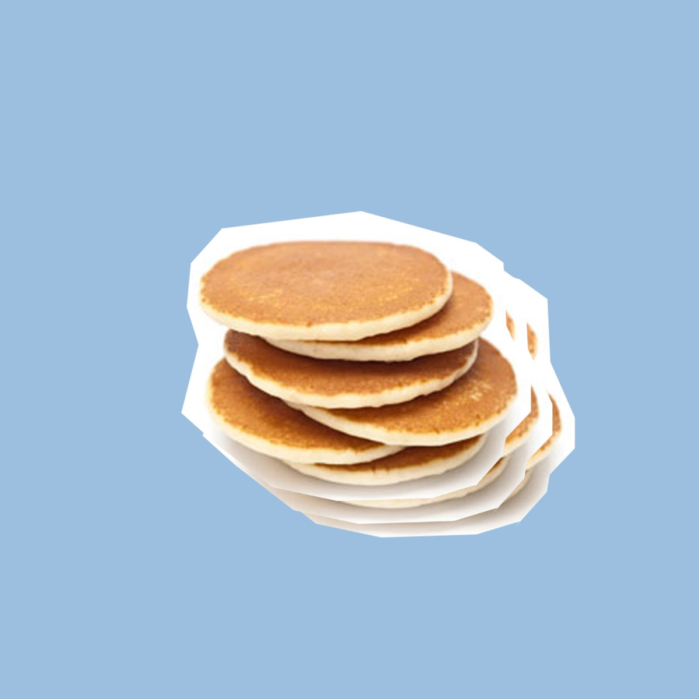

# LowVolumeFlapjacks

  

This is a project inspired by the music video for [Vulfpeck's Birds of a Feather](https://www.youtube.com/watch?v=WQm4R0LM2mE)

For the Art and Code class at OCAD U, we learned how to use the Processing programming language to build out our own creative coding projects. I chose to recreate the pancake drum set from the music video so I printed out some of my own (I couldn't make real flapjacks here unfortunately) and hooked them up to a [Makey Makey](https://makeymakey.com/)!

  

When you hit one of the pancakes, it'll play a drum sound from the data folder and display a random picture of a bird from the [Shibe Online API](https://shibe.online/).

Feel free to experiment with this project and load your own drum sounds!